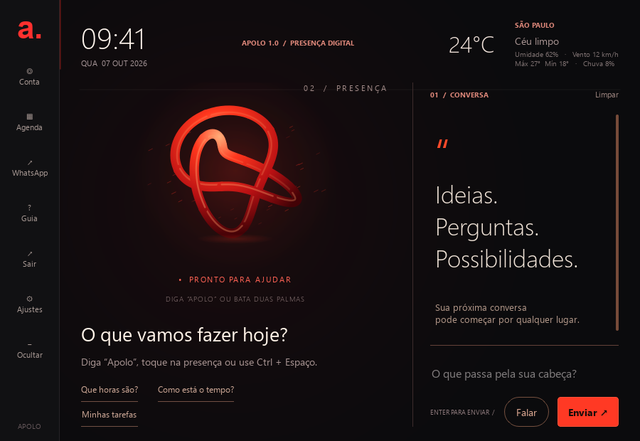
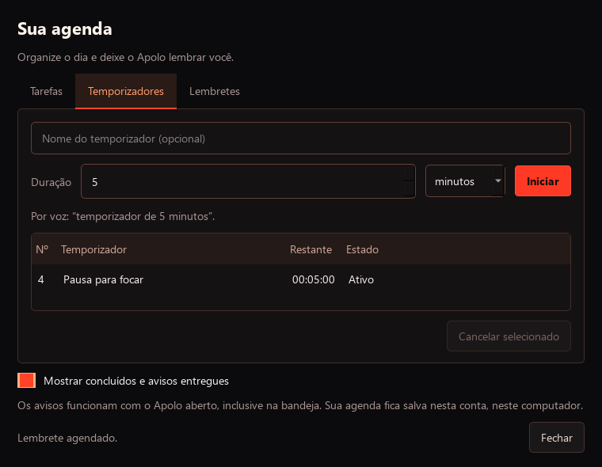

# Apolo 1.0

**Voz, conversa e produtividade para o seu dia no Windows.**

O Apolo é um assistente pessoal de código aberto, feito em Python, com interface em português e respostas com Gemini. Você pode chamá-lo pelo nome, bater duas palmas ou escrever um pedido. Ele reúne conversa, comandos do computador, música, clima e uma agenda local em uma única janela.



[Instalar](#instalação) · [Primeiro acesso](#primeiro-acesso) · [Comandos](#experimente-estes-pedidos) · [Privacidade](#dados-e-privacidade) · [Contribuir](CONTRIBUTING.md)

## O que ele faz

| Recurso | Como funciona |
| --- | --- |
| Voz e conversa | Chamada por “Apolo”, duas palmas, botão ou teclado; conversa por texto e respostas faladas. |
| Comandos do Windows | Abre aplicativos e sites reconhecidos. Operações como desligar ou reiniciar pedem confirmação. |
| Agenda | Cria tarefas, marca conclusões e guarda lembretes por conta local. |
| Temporizadores | Acompanha a contagem regressiva e avisa ao terminar, inclusive com a janela na bandeja. |
| Música | Reproduz arquivos locais ou usa integrações opcionais com Spotify e YouTube. |
| Clima | Mostra condições e previsão para a cidade configurada. |
| WhatsApp | Abre o WhatsApp Web ou prepara uma conversa com telefone e mensagem para você revisar e enviar. |
| Contas locais | Separa perfis e preferências; protege o cofre de chaves com a senha da conta. |



Esta publicação contém o **código-fonte da versão 1.0.0**. As integrações online dependem de conexão, configuração e disponibilidade dos respectivos serviços.

## Requisitos

- Windows 10 ou 11 de 64 bits.
- Python 3.11 ou 3.12 de 64 bits; a validação desta versão usa Python 3.11.
- Microfone e saída de áudio para conversar por voz. O chat e a agenda também funcionam pelo teclado.
- Internet para instalar dependências, obter os modelos de voz na primeira utilização e usar os serviços online.
- Uma chave da Gemini API para as respostas de inteligência artificial. Tarefas, temporizadores e comandos locais podem ser usados sem essa chave.

## Instalação

Instale o Python pelo [site oficial](https://www.python.org/downloads/windows/). No PowerShell, clone o projeto e prepare um ambiente separado:

```powershell
git clone https://github.com/euDavi-dev/Apolo-1.0.git
cd Apolo-1.0
python -m venv .venv
.\.venv\Scripts\python.exe -m pip install --upgrade pip
.\.venv\Scripts\python.exe -m pip install -r requirements.txt
.\.venv\Scripts\python.exe run.py
```

Você também pode baixar o ZIP do repositório, extraí-lo e executar os comandos a partir de `python -m venv .venv` na pasta extraída. Os exemplos usam diretamente o Python do ambiente; não é necessário ativá-lo ou alterar a política de execução do PowerShell.

Nas próximas vezes, abra o PowerShell nessa mesma pasta e execute:

```powershell
.\.venv\Scripts\python.exe run.py
```

Na primeira utilização, o Apolo obtém os modelos necessários à ativação local por voz. Aguarde a inicialização e mantenha a conexão disponível. Os pesos dos modelos têm licenças próprias, descritas em [THIRD_PARTY_NOTICES.md](THIRD_PARTY_NOTICES.md).

## Primeiro acesso

1. Crie uma conta local com usuário, senha de **pelo menos 10 caracteres**, nome e cidade.
2. No tutorial, confira o perfil e informe sua chave Gemini. Você pode concluir sem chaves e adicioná-las depois em **Conta → Minha conta**.
3. Conclua o guia em **Começar a usar**. A inicialização dos serviços acontece depois dessa etapa.
4. Em **Ajustes → Voz**, confira o microfone e a saída de áudio. Em **Ajustes → Ativação**, ajuste a chamada pelo nome se necessário.

Para obter a chave, acesse o [Google AI Studio](https://aistudio.google.com/apikey) e siga a [documentação oficial da Gemini API](https://ai.google.dev/gemini-api/docs/api-key). Modelos, limites de uso e cobrança são definidos pelo provedor. Escolha em **Ajustes → IA** um modelo disponível para a sua chave.

**Você não precisa criar um arquivo `.env` para usar o aplicativo.** As chaves vêm da conta ativa. O suporte a `.env` existe para alguns scripts auxiliares executados sem uma conta cadastrada.

Guarde sua senha: as contas são locais e não há recuperação de senha por e-mail. Veja os detalhes em [Contas e tutorial](CONTAS_E_TUTORIAL.md).

## Como conversar

- Diga **“Apolo”**, aguarde o sinal e faça o pedido; ou use uma frase como **“Apolo, abra a calculadora”**.
- Bata **duas palmas**, clique na presença central ou pressione **Ctrl + Espaço** para falar.
- Use **Ctrl + L** para focar o campo de texto e **Enter** para enviar.
- Abra **Guia** para rever os primeiros passos e **Agenda** para gerenciar seus itens visualmente.

O botão **Ocultar** e o **X** mantêm o Apolo ativo na bandeja. Para encerrar de verdade, use **Sair** na barra lateral ou no menu do ícone da bandeja. Ao abrir novamente, a conta pede login.

## Experimente estes pedidos

Os mesmos exemplos podem ser falados ou digitados:

| Pedido | Resultado |
| --- | --- |
| `Que horas são?` | Informa o horário. |
| `Como está o tempo?` | Consulta o clima da cidade configurada. |
| `Abra a calculadora` | Abre um aplicativo reconhecido. |
| `Me explique o que é um buraco negro` | Faz uma pergunta ao Gemini. |
| `Adicionar tarefa comprar café` | Inclui uma tarefa na agenda. |
| `Minhas tarefas` | Lista as tarefas pendentes com seus números. |
| `Concluir tarefa 1` | Marca a tarefa indicada como concluída. |
| `Temporizador de 5 minutos` | Inicia uma contagem regressiva. |
| `Me lembre de beber água em 20 minutos` | Agenda um aviso. |
| `Me lembre de ligar para Ana amanhã às 9h` | Agenda um lembrete com horário. |
| `Meus lembretes` | Mostra os lembretes ativos. |
| `Cancelar temporizador 2` | Cancela o item indicado. |
| `Toque Believer` | Procura a música no provedor configurado. |
| `Pause` | Pausa a reprodução quando há música ativa. |
| `Abra o WhatsApp` | Abre o WhatsApp Web. |
| `Prepare mensagem no WhatsApp para +55 11 99999-9999 dizendo Olá, chego às 15:30!` | Prepara uma conversa com a mensagem preenchida. |

Use o número que aparece na sua agenda para concluir ou cancelar; ele é compartilhado entre tarefas, lembretes e temporizadores. Há também os comandos `Ajuda produtividade` e `Ajuda WhatsApp`.

### Agenda e avisos

Tarefas e horários ficam guardados mesmo depois de fechar o programa. **O Apolo precisa estar aberto, inclusive na bandeja, para avisar no horário.** Se um item vencer com o aplicativo fechado ou o computador desligado, o aviso aparece quando você reabrir o Apolo e entrar na conta. Os alertas aparecem na conversa e na bandeja, sem interromper a resposta falada.

Veja mais exemplos em [Produtividade](PRODUTIVIDADE.md).

### WhatsApp

Na tela **WhatsApp**, abra o WhatsApp Web ou informe telefone com DDI e DDD e uma mensagem. Na primeira conexão, leia pelo celular o QR code exibido pelo próprio WhatsApp.

**Revise e clique em Enviar no WhatsApp.** O Apolo usa links de conversa: não lê seu histórico, acompanha respostas ou envia mensagens automaticamente ou de forma agendada. A sessão de WhatsApp é administrada pelo navegador e pelo próprio serviço.

## Configurações opcionais

### Voz online e voz local

Em **Ajustes → Voz**, escolha separadamente o reconhecimento da sua fala e a voz das respostas:

| Etapa | Padrão | Alternativas |
| --- | --- | --- |
| Detectar “Apolo” | Ativação híbrida local: detector contínuo e Whisper em português. | Reconhecimento local em português; modelos como `tiny` ou `base`. |
| Transcrever o pedido | Google via SpeechRecognition, com envio de áudio pela internet. | Gemini, também com envio de áudio, ou Whisper local. |
| Falar a resposta | Voz neural online com `edge-tts`. | Voz do Windows ou Kokoro local. |

A ativação pelo nome funciona localmente depois de obter os modelos. Isso não torna automaticamente a transcrição e a conversa offline: elas seguem os motores escolhidos. O Whisper baixa o modelo selecionado na primeira utilização.

Para experimentar a síntese local Kokoro:

```powershell
.\.venv\Scripts\python.exe -m pip install -r requirements-local-tts.txt
.\.venv\Scripts\python.exe scripts/download_voice.py
```

Depois selecione **Local (Kokoro, offline)** em Ajustes. Consulte [Ativação por voz](UPGRADE_ATIVACAO_VOZ.md) para diagnóstico e ajustes no seu ambiente.

### Música

Escolha o provedor em **Ajustes → Música**. O modo automático prioriza Spotify, YouTube e depois a pasta local, conforme a configuração disponível.

**Arquivos locais:** selecione a pasta com músicas em MP3, FLAC, OGG ou WAV. Não exige chave de API. A leitura de metadados de artista e título é opcional:

```powershell
.\.venv\Scripts\python.exe -m pip install -r requirements-music.txt
```

**YouTube:** habilite a [YouTube Data API v3](https://developers.google.com/youtube/v3/getting-started) em um projeto Google e salve a chave em **Minha conta**. O Apolo usa a API para buscar o vídeo e abre a reprodução oficial no navegador. Os controles usam teclas de mídia do Windows; o resultado depende do navegador e da sessão de reprodução.

**Spotify:** configure um aplicativo no [Spotify Developer Dashboard](https://developer.spotify.com/dashboard), com a URL de retorno `http://127.0.0.1:8888/callback`, e salve o Client ID em **Minha conta**. A [API de reprodução exige Spotify Premium](https://developer.spotify.com/documentation/web-api/reference/start-a-users-playback); aplicativos em desenvolvimento também seguem os [requisitos de conta e usuários permitidos do Spotify](https://developer.spotify.com/documentation/web-api/concepts/quota-modes). Autorize sua conta:

```powershell
.\.venv\Scripts\python.exe scripts/music_setup.py spotify
```

Abra o Spotify e mantenha um dispositivo de reprodução disponível. Depois de mudar chaves de música, encerre pelo **Sair** e abra o Apolo novamente. Para conferir a configuração:

```powershell
.\.venv\Scripts\python.exe scripts/music_setup.py status
```

### Clima

Informe sua cidade no perfil. A integração usa [Open-Meteo](https://open-meteo.com/) e não pede chave de API no aplicativo.

## Dados e privacidade

As contas do Apolo são locais ao usuário do Windows. Não há servidor de contas do projeto nem sincronização entre computadores.

| Dados | Onde ficam e como são tratados |
| --- | --- |
| Perfil e chaves | `%APPDATA%\APOLO\accounts\`: cofre criptografado com AES-GCM, usando uma chave derivada da senha com scrypt. A senha não é armazenada. |
| Agenda e preferências | `%APPDATA%\APOLO\profiles\USUARIO\`: arquivos separados por conta; a agenda SQLite contém títulos e horários legíveis. |
| Logs, caches e tokens | Também no perfil local. Esses arquivos operacionais não são todos criptografados; logs podem conter o texto dos pedidos. |
| Serviços online | Recebem os dados necessários ao recurso: texto e contexto de conversa para Gemini, áudio para o motor online de transcrição escolhido, texto para síntese online e consultas para clima ou música. |

Na configuração padrão, o áudio do pedido vai ao Google para transcrição e o texto da conversa vai ao Gemini quando é necessário gerar uma resposta. Ao selecionar transcrição Gemini, esse serviço também recebe áudio. A detecção local de “Apolo” é uma etapa separada.

Proteja a pasta de perfil pelas permissões do Windows e faça backup de `%APPDATA%\APOLO` se quiser preservar sua conta e agenda. Evite compartilhar logs, capturas, tokens ou dados dessa pasta em issues públicas.

## Ajuda e desenvolvimento

| Se acontecer… | Confira… |
| --- | --- |
| O microfone não responder | Permissão de microfone do Windows, dispositivo em Ajustes → Voz e se outro programa está usando o áudio. |
| A chamada “Apolo” não funcionar | Inicialização dos modelos, conexão na primeira utilização e o teste em Ajustes → Ativação. Você também pode usar Ctrl + Espaço ou texto. |
| O Gemini não responder | Chave em Minha conta, conexão, limites do provedor e modelo selecionado em Ajustes → IA. |
| Um lembrete não aparecer no horário | Se o Apolo permaneceu aberto e se as notificações do Windows estão habilitadas. Consulte também a conversa. |
| O programa já estiver em execução | Procure o ícone do Apolo na bandeja do Windows. |

Os testes automatizados usam dados temporários e dublês de serviços. Eles não substituem a validação com seu microfone, alto-falante, chaves reais ou contas de serviços externos. Veja os comandos e o fluxo de contribuição em [CONTRIBUTING.md](CONTRIBUTING.md).

Guias: [Contas e tutorial](CONTAS_E_TUTORIAL.md), [Produtividade](PRODUTIVIDADE.md), [Ativação por voz](UPGRADE_ATIVACAO_VOZ.md) e [Empacotamento para Windows](EXECUTAVEL_WINDOWS.md).

## Licença

O código do Apolo é disponibilizado sob a [licença MIT](LICENSE). Bibliotecas, modelos e serviços externos conservam suas próprias licenças e condições de uso; consulte [THIRD_PARTY_NOTICES.md](THIRD_PARTY_NOTICES.md). Veja as mudanças desta publicação em [CHANGELOG.md](CHANGELOG.md).
